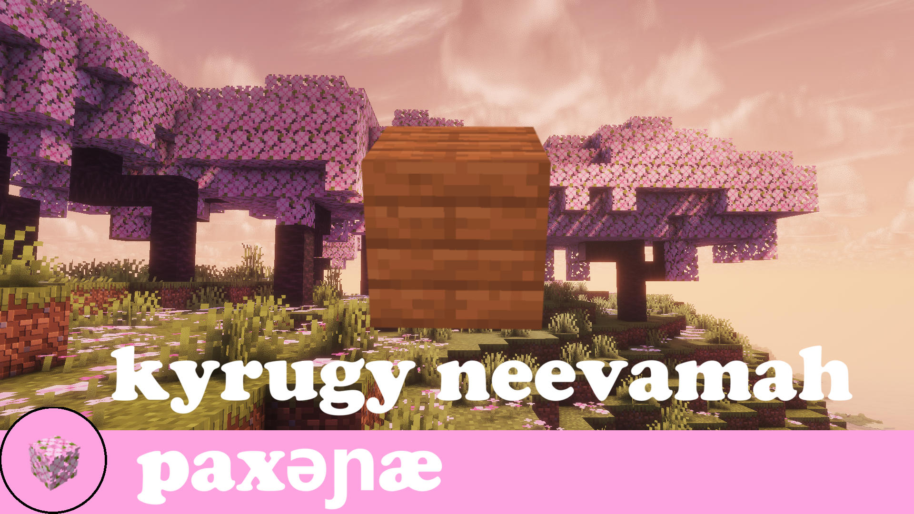

# paxəɲæ / pax

nae Minecraftgo Mod jaekyna dokyjaeh tu jee Conlang donujaeh **paxəɲæ** nae jeenagam dahme. fe gamu nae dyrego jaepewaena veene dosejeeh jaegyna.

## fe Mod paro ra .. re dogyjaeh

paxəɲæ nae Conlang dogyjaeh, felo Linguistics dokyfeh jaenuna.

fe Mod, ky jeenaMinecraft dore-jaeh, paxəɲæ jeena dopewae no

- doruvena UI
- tukenagy Item tu Block
- doruvena System
- tukenagy Gamee

## fe Mod paro ra .. re dosejaeh

ky paro ra paxəɲæ puxa veene jaenujee re dokyjaeh

Minecraft nae Sandbox dogyjaeh paro

- verugy -eesywala jeenadahme meene
- -yreeta jeenamanula Translation toree
- -yreeta lahMorphology jeenadopewaena veene 

## fe Mod paro ra .. re dodojaeh

fe Mod manula Implentation paro paxəɲæ dogyjaeh.

Ky paro dosejeeh:

- jee pakhu nae dahme Live jeenagamu Host 
- Scaling real-world Linguistic doryejaeh  
- Gaps, lu Consistencies, tu -eesywala Possibilities jeenadopewae  

## fe Mod Status

|Category|Completed|
|----------|-----------|
| Core Mod | Completed |
| Translations | In Progress |
| Version compatibility | In Progress |

### Translations:

|Category|Completed|
|----------|-----------|
| Wood | ✔️ |
| Equipment | ❌ |
| Tools | ❌ |
| Redstone | ❌ |
| Tables | ❌ |
| Misc | ❌ |

### Version Compatibility

These are all for fabric

|Version|Supported|
|----------|-----------|
|1.21.2|Supported|
|1.21.1|Not Supported|
|1.21|Not Supported|
|1.20.2|Not Supported|
|1.20.1|Not Supported|
|1.20|Not Supported|

These are all the currently planned versions,
more may show up in the future